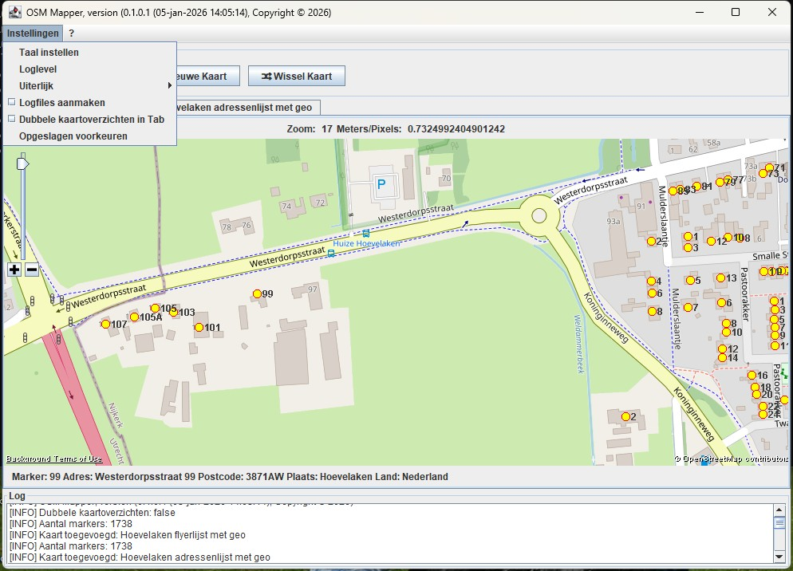

# Introductie

Dit programma haalt uit een Excel bestand informatie om markers op een kaart (Open StreetMap, OSM) te plaatsen.

# Installation
Het volgende Windows installatie kit is aanwezig:
- osmmp_vw.x.y.z_setup.exe

De kit heeft een JRE beschikbaar.

Er is ook een ZIP beschikbaar om de applicatie (zonder installatie) te draaien.

# Opening menu
When running the application (Windows excutable or Java jar-file) the following menu is shown:

# Setting menu

In het Instellingen menu zijn de volgende opties aanwezig:
- _Taal instellen_ Instellen van de taal van de GUI (alleen NL is volledig ondersteund)
- _Loglevel_ Voor debugging kan een "_loglevel_" worden ingesteld, default is level _INFO_.
- _Uiterlijk_ van de GUI kan worden ingesteld._Look and Feel_ of the GUI can be adjusted.
- _Logfiles aanmaken_ in de gekozen directory wordt een HTML- en een textfile met de logging aangemaakt.

# Excel bestand

In het Excel bestand bevat in de eerste rij de kolom kop namen.
In de koppen wordt gezocht naar de volgende (deel)teksten (niet case-sensitive):
- "postcode"
- "huisnummer"
- "toevoeg"
- "straat"
- "plaats"
- "voornaam"
- "achternaam"
- "telefoon"
- "e-mail"
- "project"
- "kleur"

Indien niet aanwezig dan worden de volgende kolommen aangemaakt en van inhoud voorzien bij genereren Geo info:
- "long"
- "lat"
- "land"

# Marker foto's

In een fotomap kunnen foto's per adres worden opgenomen.
De foto's dienen te worden opgeslagen in de volgende structuur:
~~~~~~~~~~~~~~~~~~~~~
Fotomap
|- 1234AA78
|      |- Foto1.jpg
|      |- ...
|
|- 5678BB91
|      |- Foto1.jpg
|      |- ...
~~~~~~~~~~~~~~~~~~~~~
